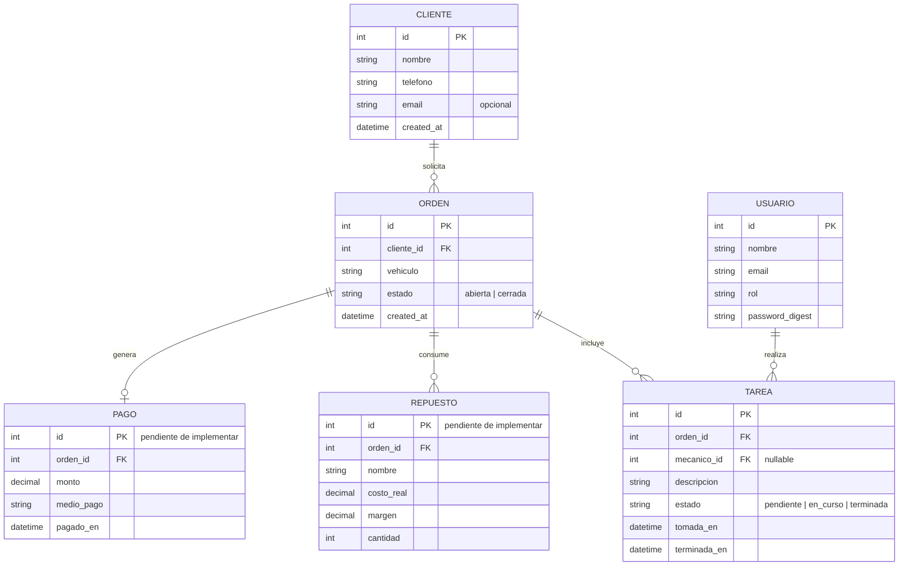

# Modelo de datos

Refleja el esquema actual (`db/schema.rb`): `Usuario`, `Cliente`, `Orden` y `Tarea`. `Repuesto` y `Pago` todavía no están implementados; se muestran en gris porque son el próximo paso natural (repuestos comprados al vuelo y cargados directo a la orden, sin catálogo ni stock permanente — ver AGENTS.md) y ayudan a leer el modelo completo del producto.

