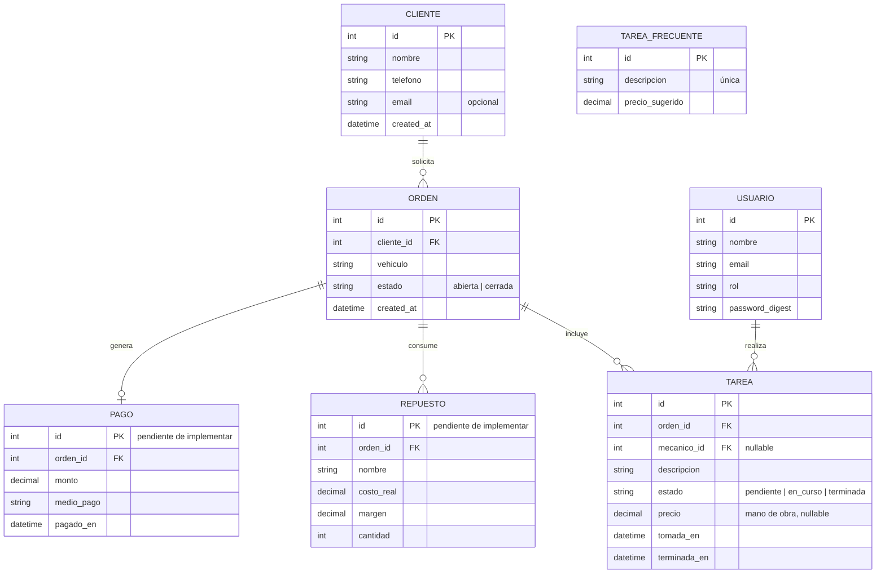

# Modelo de datos

Refleja el esquema actual (`db/schema.rb`): `Usuario`, `Cliente`, `Orden`, `Tarea` y `TareaFrecuente`. `Repuesto` y `Pago` todavía no están implementados; se muestran en gris porque son el próximo paso natural (repuestos comprados al vuelo y cargados directo a la orden, sin catálogo ni stock permanente — ver AGENTS.md) y ayudan a leer el modelo completo del producto.

`TareaFrecuente` es un catálogo simple (sin relación en base de datos con `Tarea`): al crear una tarea en una orden, el frontend puede prellenar la descripción y el precio con una entrada del catálogo, pero el valor sugerido se copia a la tarea y queda editable, no se referencia por FK.

